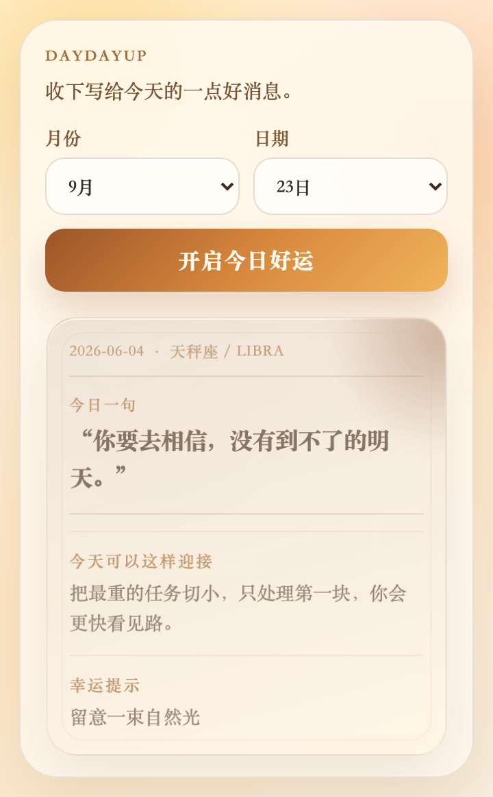

# DayDayUp

DayDayUp is a tiny browser extension that turns your birthday into a gentle daily zodiac card.

It is not a serious fortune-telling tool. It is a small positive anchor for the day: choose your birthday, open today’s card, and get one warm sentence, one gentle action, and one lucky cue.



## What it does

- Calculates your zodiac sign from month and day
- Generates a deterministic daily card from your sign and date
- Works offline with local content, no API key required
- Runs as a compact Manifest V3 browser extension popup
- Keeps the tone positive, soft, and reassuring

## Why I built it

This is a small vibe-coding showcase project: a browser extension with a complete interaction loop, local content generation, tests, and a polished popup UI.

The goal is to make something simple enough to try immediately, but refined enough to feel like a real product detail.

## Tech stack

- React
- TypeScript
- Vite
- Vitest
- Testing Library
- Chrome Extension Manifest V3

## Try it locally

Install dependencies:

```bash
npm install
```

Run the local development page:

```bash
npm run dev
```

Run tests:

```bash
npm test
```

Build the extension:

```bash
npm run build
```

## Load as a browser extension

After building, load the `dist` folder as an unpacked extension:

1. Open Chrome or Edge
2. Go to `chrome://extensions`
3. Turn on Developer mode
4. Click “Load unpacked”
5. Select the `dist` directory from this project
6. Click the DayDayUp extension icon

## Project structure

```text
src/
  App.tsx                 # Popup UI
  core/
    zodiac.ts             # Birthday → zodiac sign
    generateCard.ts       # Daily card content engine
public/
  manifest.json           # Extension manifest
docs/
  daydayup-popup.png      # README screenshot
```

## Notes

DayDayUp does not request browser permissions and does not send your birthday anywhere. The current version is fully local.
